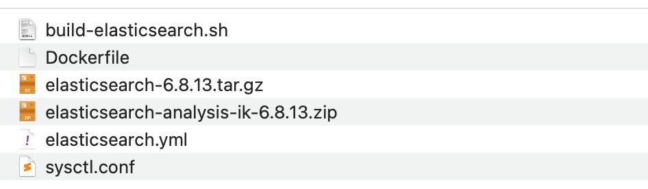

[toc]

# 制作centos7-arm下的elasticsearch 6.8.13 docker镜像（单节点-无密码）

## 首先将母盘的es相关配置好

### sysctl.conf修改

```shell
vm.max_map_count=655360
#一个 Linux 内核参数设置，用于控制一个进程可以拥有的最大内存映射区域的数量。这个参数对于一些需要大量内存映射的应用程序，特别是那些使用内存映射文件或大型数据库的应用程序（如 Elasticsearch、MongoDB 等）来说非常重要。
```

### [启动ceontos7-arm镜像](https://github.com/lihu1990/lihu1990.github.io/blob/main/centos7%20-arm%E5%88%B6%E4%BD%9C%E8%BF%87%E7%A8%8B.md)

### copy sysctl.conf 文件到启动的母盘中

```shell
docker cp ./sysctl.conf centos01:/etc/
```

### 限制es使用的资源

```shell
echo "* soft nofile 65536"  >> /etc/security/limits.conf
echo "* hard nofile 131072" >> /etc/security/limits.conf
echo "* soft nproc 2048"    >> /etc/security/limits.conf
echo "* hard nproc 4096"    >> /etc/security/limits.conf
```

## 提交临时镜像做最新的母盘

```shell
docker commit -a "lihu" centos01 charlesjimi/centos7:centos7-arm-jdk1.8
#dockerhub这里有制作好的，大家可以直接使用
# docker pull charlesjimi/centos7:centos7-arm-jdk1.8
```

## 开始编写制作esdocker内容


### 整体内容如下



### Dockerfile

```shell
#使用刚刚自己制作的母盘镜像
FROM charlesjimi/centos7:centos7-arm-jdk1.8
ENV VERSION=6.8.13
MAINTAINER lihu
COPY ./elasticsearch-${VERSION}.tar.gz /usr/local
RUN cd /usr/local && tar zxvf elasticsearch-${VERSION}.tar.gz && rm -f elasticsearch-${VERSION}.tar.gz
RUN mkdir -p  /usr/share/elasticsearch/data && mkdir /usr/share/elasticsearch/log 
ADD ./elasticsearch.yml /usr/local/elasticsearch-${VERSION}/config/elasticsearch.yml
COPY ./elasticsearch-analysis-ik-${VERSION}.zip  /usr/local/elasticsearch-${VERSION}/plugins
RUN cd  /usr/local/elasticsearch-${VERSION}/plugins && unzip elasticsearch-analysis-ik-${VERSION}.zip -d analysis-ik && rm -f elasticsearch-analysis-ik-${VERSION}.zip
RUN useradd es
RUN chown -R es:es /usr/local/elasticsearch-${VERSION}/ && chown -R es:es /usr/share/elasticsearch
USER es
#WORKDIR指令用于指定容器的一个目录， 容器启动时执行的命令会在该目录下执行
WORKDIR /usr/local/elasticsearch-${VERSION}
#目录就会在运行时自动挂载为匿名卷，任何向/usr/share/elasticsearch/data中写入的信息都不会记录进容器存储层，从而保证了容器存储层的无状态化
VOLUME ["/usr/share/elasticsearch/data","/usr/share/elasticsearch/log"]
#CMD用于设置默认执行的命令
CMD ["/usr/local/elasticsearch-6.8.13/bin/elasticsearch"]
EXPOSE 9200 9300
```

### [其他材料](./单节点-无密码材料)
[elasticsearch-6.8.13.tar.gz](https://www.elastic.co/cn/downloads/past-releases/elasticsearch-6-8-13)
[elasticsearch-analysis-ik-6.8.13.zip](https://github.com/infinilabs/analysis-ik/tags)

### 编译制作

```shell
docker build -f ./Dockerfile -t charlesjimi/elasticsearch:arm6.8.13-analysis-ik-single-node-nopwd .
# 推送到docker hub
docker push charlesjimi/elasticsearch:arm6.8.13-analysis-ik-single-node-nopwd .
```
